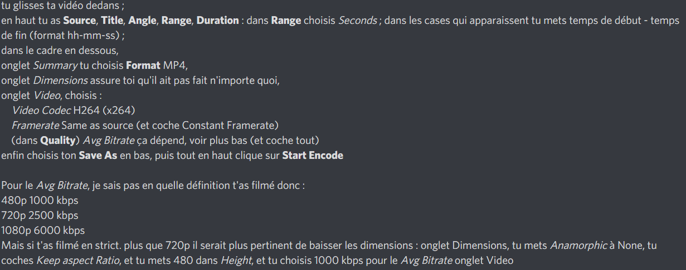

# Papertube !

**Bien tout lire (rapidement en diagonale) avant de commencer à filmer et tout**

## Keskifofer

### Stream caméra vers pc

Si tu as moyen de tester ce serait cool, avec mon portable c'est relativement pas mal (j'ai 28 fps). Il faut que le tél et le PC soient sur le même wifi.

Avec Droidcam X Pro (payant, faut passer par Aptoide)

dans les paramètres de l'appli, activer le Boost FPS

sur VLC, ouvrir un flux réseau, mettre le "http://ip:4747/video" comme dit dans l'appli

sur VLC, personnaliser l'interface pour mettre le bouton Enregistrer dans la barre d'outils, puis enregistrer la vidéo avec ce bouton...

### Prérequis

il faut pip install les modules suivants :
```
pyWavelets
opencv-python
```
si tu n'as pas Anaconda, il te restera peut être à installer scipy, csv, sqlite...

Logiciels : Handbrake, SQLite DB Browser

### Git

si tu ne l'as pas déjà fait, clone le projet.
avec git sur WSL on aurait fait comme ça :
```
cd /mnt/lettre-du-disque/chemin-windows-vers-tes-documents
git clone https://gitlab.ensimag.fr/bourdiny/papertube.git
```
pull au cas où à chaque fois que tu reviens sur le projet

commit régulièrement (`git commit -m "description du commit"`)

push régulièrement

### Utilisation, avec Pyzo

#### Remarque concernant les chemins de fichiers
ils n'ont normalement pas besoin d'être changés :d

ouvre main.py, fais Ctrl+Shift+E (Run file as script)

#### Pré-traitement des vidéos, avec Handbrake

comme dit sur Discord :

si possible, la vidéo doit commencer après que la feuille ait été relachée, une fois qu'elle est "à l'équilibre" prête à jerk, et s'arrêter vite après le dernier à-coup.
fais un sous-dossier dans video/ (que j'appelerai ici *banane*) et mets toutes les vidéos à traiter dedans

**Remarque importante** : mieux vaut faire un sous-dossier pour chaque série de mesures d'un même paramétrage de papier, par exemple un sous-dossier "01" peut-être ta première série où tu as testé plusieurs fois un papier A4, 2x20, surface carton, ...
ça sera beaucoup plus pratique pour mettre à jour la base de données (DB)

#### Vidéo -> courbe

dans Pyzo,
```
processDir(../../video/banane/, ../../video_data/)
```

#### Importation dans la DB : papertube.db

```
intoDB(../../video/banane)
```

cela te demandera de renseigner tous les paramètres relatifs à ta série de mesures (tous les fichiers dans *banane/* auront les mêmes paramètres) ; je te conseille de jeter un oeil à la structure de la DB

#### Courbes -> graphiques d'à-coups et fréquence

s'ils n'existent pas, crée les dossiers fig_peaks_main et fig_freq_main à la racine du projet
```
processDataDir(../../video_data/)
```

tu retrouveras dans fig_peaks_main/ et fig_freq_main/ les résultats (respectivement les graphes de détection des à-coups, les courbes temps-fréquence)
